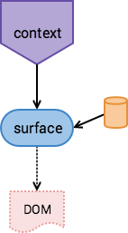
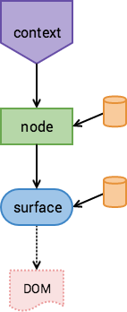
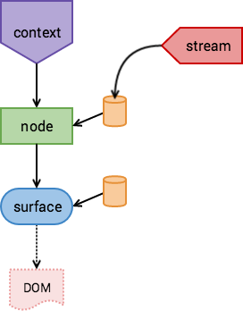
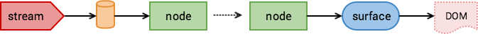

Samsara's goal is to building a pipeline that begins with some dynamic quantity, be it user input like a gesture, 
or a time-varying value like a `Transitionable`, and ends a layout change in the DOM. Many libraries allow the
animation of a single DOM node with a simple API. Perhaps something that looks like this:

```js
SomeLibrary.animate('#myId', {
    opacity : 1,
    duration : 1000,
    curve : 'easeIn'
});
```

Where Samsara is different is that it enables the coordinate hundreds of animations on hundreds of DOM nodes in a highly
dependent environment: where the layout and size of one object may depend on the layouts and sizes of others. The way it 
is able to do this is to take a holistic perspective on layout.

### Layout as a Stream

To describe the dependencies of layout, we build up a render tree. "Tree", however, is a misnomer. It's better to think 
of the render tree as one big stream. Child nodes subscribe to parent nodes, and listen for their changes.
Changes begin with some time-varying value and cascade down through the render
tree based on these listeners until they bottom out in the DOM. Let's see how this looks with some simple examples.

```js
var context = new Context();
var surface = new Surface({proportions : [.5,.5]});
	
context.add(surface);
context.mount(document.body);
```

Visually, the render tree looks like: 

<p align="center"></img></p> 

This will create a `Surface` half the size of the viewport, aligned at the top left. It may not seem like it, but
already there are streams at play. When you resize the window, or rotate your mobile device the `Surface's` size will
keeps its proportions relative to the viewport.

The `window` size is an implicit stream inside of Samsara. A `Context` listens to it
and on a `resize` event, will query the DOM for its size, and pass that information to the
`Surface`. The `Surface` then calculates its size based on its `proportions` data
and commits that information to the DOM. We have our first pipeline that begins
from the `window's` resize event, gets converted into a stream, gets processed by the render tree, and exits in the DOM.

### Nodes

A node is just a [merged stream](streams.md#combining-streams). When its sources are emitting events, so is the node:

```js
var opacity = new Transitionable(0);

var node = context.add({
    opacity : opacity,
    size : [100,100]
)};

node.on('start', function(data){
    console.log(data); // {opacity : 0, size : [100,100]}
});

node.on('end', function(data){
    console.log(data); // {opacity : 1, size : [100,100]}
});

opacity.set(1, {duration : 1000});
```

Each time the render tree is expanded with the `add` method, listeners between the newly created node and its parent are set up. 
Any time a node updates, its children receive and event and modify their layout information, they then emit an event and the cycle continues.

### Node Composition

As layout information flows down the render tree, it is composed at each step. Each node has its own layout data,
and composes it with the layout coming from its parent using the [lift method](streams.md#combining-streams) on streams.

Sizes beginning from the `Context` are composed using the [size algebra](render-tree.md#size-properties).
A `Surface's` or `View's` `.size` property is exactly this lifted stream. Layout properties are computed similarly, 
beginning at the `Context` and composed using the [layout algebra](render-tree.md#layout-properties).

Eventually we get to a `Surface` which commits its `size`, `transform` and `opacity` to the DOM. Here's an example:

```js
var context = new Context();
var surface = new Surface({proportions : [.5,.5]});

context
    .add({size : [undefined, 100]})
    .add(surface);
```

This is a visualization of this code:

<p align="center"></img></p>

Here we create a node specifying a size. A width of `undefined` means take on the parent's (in this case the `Context's`) 
width, while a height of 100px overrides the parent height. The `Surface` then has half the width of the `Context` and 
a height of 50px.

Since the node is listening to the `Context` upon creation, when the `window` is resized, update events 
trickle through the `Context` then to the node, then to the `Surface`, then to the DOM.

### A Pipeline to the DOM

Previously the time-varying data in our examples has been the `window` size. Events don't need to begin at the `window`, 
however, they can begin from any stream. Let's make this more explicit: instead of a size of `[undefined, 100]` 
we'll animate the size with a `Transitionable`.

```js
var surface = new Surface({proportions : [.5,.5]});
var size = new Transitionable([undefined, 100]);

context
    .add({size : size})
    .add(surface);
	
surface.on('click', function(){
    size.set([undefined, 200], {duration : 500});
});
```

Visually, it looks like this:

<p align="center"></img></p>

Now the height of the `Surface` will animate from 50px to 100px when it's clicked. What we've really built is a pipeline to the DOM. 
The pipeline starts at a stream, passes through the render tree, and exits to the DOM. It may be better to visualize 
this flow like this:

<p align="center"></img></p>

Notice in the above example, the `Context's` size does not need to be recomputed in order to determine the correct width.
In fact, Samsara will not visit the `Context` because it hasn't emitted any events. Only when the `window` resizes will 
the `Context` emit events that ripple through the render tree. 

This highlights an important point: all business logic for the layout is connected by passive listeners that are only called when 
their sources of data change. Only the parts that change are recalulated - there is no dirty checking, diffing or 
cache invalidation step.