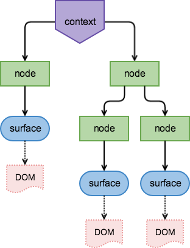

Layout takes the form of a tree structure because most of layout is positioning one thing relative to another. 
In HTML, the tree is the DOM tree, and relative positioning is done by nesting DOM elements. 
In Samsara the nesting is done in JavaScript in what's called the render tree. 

By doing layout in JavaScript, we can be much more flexible than CSS. For instance, with CSS alone you cannot track a 
`<div>` with your finger, or synchronize the transforms in two CSS classes, or get the current velocity of an animation, 
etc. There are costs, however, to doing layout in JavaScript. For one, all computation must happen on the main thread, 
and can't be offloaded to the UI thread. This requires us to be CPU conscious and places a high priority on performance
to achieve 60 frames per second. The critical part of the performance of Samsara is that the render tree is a low-footprint
model of the layout of Samsara elements, and it is [architected](architecture.md) to only update the parts of Samsara that change in time.

The render tree begins with a root called the `Context` and is built up of nodes with various layout data. 
The leaves of the tree are `Surfaces`. Unlike HTML, only the leaves of the tree have a visual representation
in the DOM. This representation is modified by the nodes above them, which manifest in the DOM as 
changes to `opacity`, `size`, and `transform` CSS properties.


<p align="center"> </p>

To calculate the final properties of a `Surface`, one composes the properties of all the nodes above it. 
For instance, the final opacity of a `Surface` is the multiplication of all opacity values defined above it. 

## Context

The [`Context`](http://samsarajs.org/reference_docs/classes/DOM.Context.html) is the root of the render tree. It establishes a 3D context for `Surfaces` that are added to it.

```js
var Context = Samsara.DOM.Context;
var Surface = Samsara.DOM.Surface;

var context = new Context();

var surface = new Surface({
    size : [100,100],
    properties : {background : 'red'}
});

context.add(surface);
context.mount(document.body);
```

`Context's` are mounted to a DOM element, and export their content, in this case a single `Surface` into that element.

`Contexts` also have `setPerspective` and `setPerspectiveOrigin` methods to apply a [3D perspective](https://developer.mozilla.org/en-US/docs/Web/CSS/perspective)
to the `Surfaces` within it. 

## Nodes

Nodes are JSON objects that can be added to the render tree. They modify the size and layout of the tree below them. 
Nodes take special keys defined below, whose values can be static quantities (e.g., numbers, arrays) or [dynamic streams](animation.md) for 
animation and responsive design. 

Nodes shouldn't be thought of as existing in a vacuum, they are part of the larger render tree, and so can take "relative"
quantities. Just as in CSS, you can define an element's width to be 50%, this only means something in the larger context 
of the HTML page. Node properties come in two flavors: size properties and layout properties.

#### Size Properties

| Key | Type | Description |
| --- | ---- | ----------- |
| size | `[w,h]`  | Defines a size in pixels. Values can be numeric, or also `undefined`, `true` or `false` (see below)|
| proportions | `[w,h]` | Defines a size using ratios of the parent size dimensions |
| margins | `[x,y]` | Subtracts a number of pixels from the current width and height |
| aspectRatio | `Number` | Scales the width by the height if the height is `false`, or visa-versa if the width is `false`|

As stated above, size dimensions can take non-numeric values, which translate to the following:

| Size Dimension Value | Description |
| ----- | ----------- |
| Number | Use this value in pixels |
| undefined | Use the parent node's value |
| true | Use the DOM's calculated value |
| false | This value will be ignored |

> Note: Currently using `true` sizing only works for `Surfaces` and not for nodes in general, though future versions of 
Samsara will remedy this.

Here we show a few examples to illustrate the flexibility of defining size in Samsara. Though we talk of nodes
as being explicitly added to the render tree, nodes effecting size are also implicitly inside of `Surfaces`.

<p data-height="454" data-theme-id="20796" data-slug-hash="eJrbgR" data-default-tab="result" data-user="samsaraJS" class='codepen'>See the Pen <a href='http://codepen.io/samsaraJS/pen/eJrbgR/'>size</a> by SamsaraJS (<a href='http://codepen.io/samsaraJS'>@samsaraJS</a>) on <a href='http://codepen.io'>CodePen</a>.</p>
<script async src="http://assets.codepen.io/assets/embed/ei.js"></script>
<br> 

#### Layout Properties

There are also nodes that affect layout, which encompasses modifying position, rotation, scale, skew, and opacity.

| Key | Type | Default | Description |
| --- | ---- | ------- | ----------- |
| transform | `Transform` | `Transform.identity` | A CSS3 transform representing a combination of translation, rotation, scaling or skewing |
| opacity | `Number` | 1 | Defines the opacity |
| align | `[x,y]` | `[0,0]` | Defines a translation by a proportion of the parent size |
| origin | `[x,y]` | `[0,0]` | Defines a translation by a proportion of the currently defined size|

Though `transform` and `opacity` are clear in how they modify the render tree, `align` and `origin` 
are Samsara specific. They are a shorthand for creating transforms relative to a defined size. For example,
they can be used for centering, or aligning something relative to the bottom right, etc.

In more detail, let's assume a parent size of `[w, h]` and a node size of `[w', h']`. We would like to align
the node relative to the parent size.

* An align value of `[x,y]` will produce a translation of `[w * x, h * y]`, and is a shorthand for 
`Transform.translate([w * x, h * y])`.

* An origin value of `[x,y]` will produce a translation of `[-w * x', -h * y']`, and is a shorthand for 
`Transform.translate([-w' * x', -h' * y'])`.

It may be easier to think of alignment as aligning the origin point. Hence to center
the top left of a `Surface` all that is needed is to align it with `[.5, .5]` (as the origin defaults to top left). 
To center the middle of a `Surface` you will also need to define an origin of [.5, .5] on the `Surface`. 
Here's an example demonstrating how this is used.

<p data-height="300" data-theme-id="20796" data-slug-hash="MKGLwV" data-default-tab="result" data-user="samsaraJS" class='codepen'>See the Pen <a href='http://codepen.io/samsaraJS/pen/MKGLwV/'>alignment</a> by SamsaraJS (<a href='http://codepen.io/samsaraJS'>@samsaraJS</a>) on <a href='http://codepen.io'>CodePen</a>.</p>
<script async src="http://assets.codepen.io/assets/embed/ei.js"></script>

## Surfaces

The render tree bottoms out in [`Surfaces`](http://samsarajs.org/reference_docs/classes/DOM.Surface.html), which are 
ultimately responsible for creating elements in the DOM
and updating their inline styles. `Surfaces` come bundled with their own layout node, so they can take
node properties modifying their size (`proportions`, `margins` and `aspectRatio`) and layout (`origin` and `opacity`).
However, `transform` and `align` are properties "external" to a `Surface` and can only be defined by nodes above them
in the render tree.

`Surfaces` take other DOM-related values, such as 

* `content` - the innerHTML
* `attributes` - DOM attributes
* `properties` - CSS style properties
* `classes` - an array of comma-separated CSS classes

`Surfaces` can listen to any DOM events, such as `click`, by calling the `on` method. This is also
true of `Contexts`.

```js
surface.on('click', function(event){
    console.log("I've been clicked");
});
```

#### ContainerSurface

The DOM output of Samsara is generally flat, with the heirarchical nesting happening in JavaScript, instead of HTML.
Occasionally nesting is necessary, for example, to provide clipping. For these purposes Samsara has a class
similar to a `Surface` called a [ContainerSurface](http://samsarajs.org/reference_docs/classes/DOM.ContainerSurface.html).

A `ContainerSurface` maintains its own render tree, similar to a [`View`](#views) and nests `Surfaces` inside it, 
similar to a `Context`. Here's an example of using a `ContainerSurface` to clip another `Surface`:

```js
var container = new ContainerSurface({
    size : [150, 150],
    origin : [.5,.5],
    properties : {
        overflow : 'hidden',
        border : '1px dashed black'
    }
});

var surface = new Surface({
    size : [150, 150],
    origin : [.5,.5],
    properties : {background : 'red'}
});

container.add({
    align : [.5,.5],
    transform : Transform.rotateZ(Math.PI/4)
}).add(surface);

context.add({align : [.5,.5]}).add(container);
```

<p data-height="266" data-theme-id="20796" data-slug-hash="MKBaxW" data-default-tab="result" data-user="samsaraJS" class='codepen'>See the Pen <a href='http://codepen.io/samsaraJS/pen/MKBaxW/'>container surface</a> by SamsaraJS (<a href='http://codepen.io/samsaraJS'>@samsaraJS</a>) on <a href='http://codepen.io'>CodePen</a>.</p>
<script async src="http://assets.codepen.io/assets/embed/ei.js"></script>

## Render Tree Construction

The `Render Tree` is enlarged by calling the `add` method with `nodes`, `surfaces` or [`views`](#views).
By chaining `add` calls we linearly build up the tree, whereas by calling `add` on the same node successively we branch the tree.

#### Chaining

By chaining nodes, their effects compound: their transforms are composed, and their opacities are multiplied, etc.

```
  context             var context = new Context();
     │
   node1              context.add(node1)
     │                       .add(node2)
   node2                     .add(surface);
     │
  surface
```

#### Branching

By branching nodes, we create independent parts of the tree.

```
      context                var context = new Context();
   ┌─────┴─────┐
 node1      surface2         context.add(node1).add(surface1); // left branch
   │
surface1                     context.add(surface2); // right branch
```

#### Relative Layout

By mixing branching and chaining, we can group `surfaces` together and change their properties simultaneously. In the below example, if we change the data in `node1` it will change both `surfaces`. If we change the data in `node2` only `surface1` will be affected.

```
      context                var context = new Context()
         │
       node1                 var relativeNode = context.add(node1);
   ┌─────┴─────┐
 node2      surface2         relativeNode.add(node2).add(surface1); // left branch
   │
surface1                     relativeNode.add(surface2); // right branch
```

## Views

So far we've seen that you can add nodes and Surfaces to the Render Tree.
These can be thought of as the lego blocks of more complicated objects. A section
of the render tree can be encapsulated in what's called a `View`. Samsara comes with a `View`
class that can be extended for custom views, and then added to the render tree just like nodes
and `Surfaces`. A `View` provides methods for constructing its own render tree, and also includes
support for receiving and broadcasting events, and taking in default options. 
SamsaraJS also ships with a library of common views that we will keep adding to. You can
read more about `views` [here](views.md). For now we will only be concerned about how `Views`
are used to encapsulate their own render trees.

In the example below, we add a Scrollview.

```js
      context                var context = new Context();
         │
       node0                 context.add(node0).add(scrollview);
         │
     scrollview
```

Internally, `Scrollview` has its own complex logic, but that is hidden from the
developer, who can simply include it in her project by adding it like any other node. 

The `scrollview` itself has its own render tree, populated with nodes and `surfaces` (or other `views`)
from its own custom logic.

```js
     scrollview              scrollview.addItems([S0, S1, S2, ... , S9]);
 ┌───┬───┼───────┐
S0  S1  S2   ⋯  S9
```

In the above example, `S9` doesn't have to be a `Surface`; it could
have been a `View` with its own render tree, even another scrollview itself.
Perhaps the render tree for `S9` looks like this:

```js
         S9                  S9.add(node1).add(surface1);
    ┌─────┴─────┐
  node1       node2          S9.add(node2).add(surface2);
    │           │
surface1    surface2
```

If we were to unravel the entire render tree, we would find it looks like:

```js
      context
         │
       node0
         │
     scrollview
 ┌───┬───┼───────┐
S0  S1  S2   ⋯  S9
           ┌─────┴─────┐
         node1       node2
           │           │
       surface1     surface2
```

By encapsulating complex logic in `Views`, understanding an app becomes more
manageable. And unlike DOM, there is no performance degradation incurred from
nesting structure. This nested structure only exists in JavaScript, and is 
flattened by the time it gets to the DOM.
